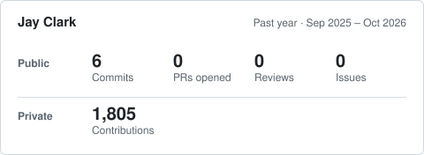

# Hi, I'm Jay Clark 👩🏻‍💻

I'm a full stack developer with nearly a decade of relevant business and teaching experience, expertise in and enthusiasm for accounting, data science, and healthcare, and a special talent for DevOps, CI/CD, and Debugging. 
  

 
## Contributing
I'm interested in contributing to projects on a volunteer or part time contract basis, preferably JavaScript-heavy or backend-heavy work.

## My Background
### Version 1.0 : Harvard, Here I Come  
I studied medical ethics at Harvard and wrote my undergraduate thesis on how online forum participants debated news about Dolly, the cloned sheep. I stayed at Harvard and earned a PhD, focusing on how patients with rare diseases attempted to raise the perceived importance of their illness among government agencies by establishing new kinship relationships between their rare disease and other, more 'important' diseases - and how the internet rapidly expanded the tools they had available to make those connections.  
   
### Version 2.0 : California Dreamin & Learning to Code
I moved to sunny San Diego (no more snow!) and worked as a consultant at an award-winning government relations firm. I caught the software engineering bug when I taught myself to code in order to build a dispatch & GPS tracking web app to help a major airport shuttle business comply with new regulations. I am still so impressed that tiny GPS devices made in South Africa and installed in cars in San Diego could send messages TO SPACE and then to a Czech company that then sent the data to my Chicago-hosted web app and onto the end-user iPads of airport shuttle staff in San Diego - all in just a few seconds.
   
### Version 2.1 : Startup Life   
I served as COO and Acting CTO of a talent management agency for Twitch streamers that was featured in the New Yorker's 2017 tech issue. I was the sole developer working on extending and customizing the software that ran the business, and I managed a small engineering team that built an analytics platform that ingested all Twitch broadcast data and used it to make predictions about broadcaster growth and sponsored content timing & prices. 
  
### Version 3.0 : Back to School to Fill in the Gaps
The talent management agency I'd co-founded shut down three months into the pandemic. I'd enjoyed software engineering so much in my two previous roles and thought it would be fun to try working at a larger company. While my team and I had used many of the concepts of modern development (agile, version control, testing, ci/cd), we weren't using the most well known or modern tools that larger tech companies would want to see experience in, so I had some catching up to do. I rented out my house, hit the road as a digital nomad, and committed to a re-training program of self study using open courseware in Computer Science fundamentals and Math, plus two paid professional certificates: [Full-stack Web Development](https://xpro.mit.edu/programs/program-v1:xPRO+PCCx+R1/), and [Machine Learning](https://learn-xpro.mit.edu/machine-learning).   
 
### Version 4.0 : Day 1
Toward the end of my self-study, I received an offer to join the Amazon Fresh team as a Software Development Engineer working in post-order telemetry (big data, machine learning, event platforms, and anomaly detection.) I accepted, and joined the team in summer 2022. At Amazon, I built real-time anomaly detection microservices in Java and TypeScript - performing 1.5M+ refund audits using Kinesis streaming, building graph database tooling on AWS Neptune, and jumping into on-call rotation 60 days ahead of schedule just because I couldn't help myself. I left having cut median deployment block time by 82%, with a much deeper appreciation for what it means to operate mission critical systems at genuine scale.

### Version 4.1 : We're Just Getting Started
I joined Remitly in 2023 and have spent the last few years doing some of the most meaningful and technically interesting work of my career. As an Engineering Manager in Global Money Movement, I built MOCHA: a zero-to-one internal product that consolidated 5 separate tooling services into a single platform with risk-tiered change control, used by non-technical operations staff to safely configure a payment network processing tens of billions of dollars in transactions. I also led an initiative that expanded US ACH bank deposit support from 28 to 9,000+ financial institutions. More recently, as a Technical Lead and product engineer on the High Value Senders team, I've been building a company-wide recommendations policy engine serving 51 million personalized recommendations per day at sub-22ms TP50 latency, architecting a contextual content platform that lets teams run complex merchandising experiments without touching front end code, and a rearchitecture of transfer preview and submission logic across 6 teams and 4 Tier 1 services that unlocked $70M in incremental annual send volume and aligned the preview and submit process to company North Star architecture. I also built an agentic SDLC pipeline that now seeds High Value Sender product projects across the company.

## Personal Projects

Most of my personal projects right now are side projects at work, so I don't have much recent work that I can share publicly. Some of the fun things I've been noodling on at work:

-redactied-
A cloud-based autonomous AI agent orchestrator running the full SDLC lifecycle from product discovery through PRD, Technical Design, Implementation, Verification, and Rollout.

-redactied-
A service to monitor ongoing experiments and alert if specific invariant conditions are breached that might affect experiment results.

-redactied-
A service to perform automated verification and screenshotting/video recording of AI-generated pull requests adding new UI features.

-redactied-
A mocking service that sits in the internal service mesh and can mimic any partner or internal api on demand on a user-by-user basis, enabling targeted testing in preprod of new APIs and hard-to-reach error edge cases.

And one personal project that's not yet public:

Braggle
An app to help employees keep a running 'brag book' of their daily and weekly accomplishments for incorporating into resumes, job applications, and internal promo & review documents.

<!---
jayeclark/jayeclark is a ✨ special ✨ repository because its `README.md` (this file) appears on your GitHub profile.
You can click the Preview link to take a look at your changes.
--->
